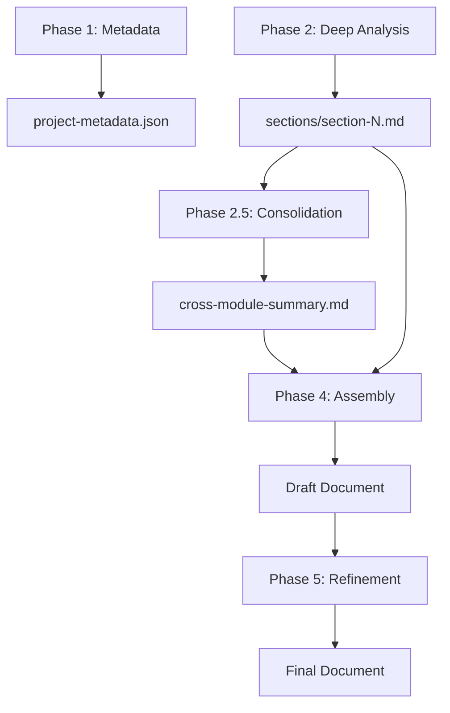

# Software Copyright Documentation Workflow

Generate CPCC-compliant software design specification documents (软件设计说明书) through multi-phase code analysis.

## Architecture Overview



## Key Design Principles

1.  **Direct Markdown Output**: Agents write directly to MD files to avoid JSON conversion overhead.
2.  **Concise Returns**: Agents return paths and summaries, not full content.
3.  **Consolidation Agent**: A dedicated step for cross-module consistency checking.
4.  **Reference Assembly**: Phase 4 reads files to merge, reducing context load.

## Execution Flow

### Phase 1: Metadata Collection
**Goal**: Collect software name, version, category, and scope.
**Action**:
1.  Use `view_file` to read the guide: `e:/HuProject/PHDCode/A_InProgressProjects/Copyright-Autodocs/.agent/resources/copyright-docs/references/phases/01-metadata-collection.md`
2.  Collect necessary information from the user or codebase.
3.  Output `project-metadata.json` to the scratchpad directory.

### Phase 2: Deep Code Analysis (Parallel Execution)
**Goal**: Analyze code to generate specific design sections.
**Action**:
1.  Use `view_file` to read the guide: `e:/HuProject/PHDCode/A_InProgressProjects/Copyright-Autodocs/.agent/resources/copyright-docs/references/phases/02-deep-analysis.md`
2.  Reference CPCC requirements: `e:/HuProject/PHDCode/A_InProgressProjects/Copyright-Autodocs/.agent/resources/copyright-docs/references/specs/cpcc-requirements.md`
3.  Execute analysis for each module (Architecture, Functions, Algorithms, etc.).
4.  Write results to `sections/section-N.md`.

### Phase 2.5: Consolidation
**Goal**: Ensure cross-module consistency.
**Action**:
1.  Use `view_file` to read the guide: `e:/HuProject/PHDCode/A_InProgressProjects/Copyright-Autodocs/.agent/resources/copyright-docs/references/phases/02.5-consolidation.md`
2.  Analyze the generated sections for consistency.
3.  Output `cross-module-summary.md`.

### Phase 4: Document Assembly
**Goal**: Merge all sections into a single draft.
**Action**:
1.  Use `view_file` to read the guide: `e:/HuProject/PHDCode/A_InProgressProjects/Copyright-Autodocs/.agent/resources/copyright-docs/references/phases/04-document-assembly.md`
2.  Merge `project-metadata.json`, all `sections/*.md`, and `cross-module-summary.md`.
3.  Create the draft document `{SoftwareName}-DesignSpec.md`.

### Phase 5: Compliance Review & Refinement
**Goal**: Final polish and compliance check.
**Action**:
1.  Use `view_file` to read the guide: `e:/HuProject/PHDCode/A_InProgressProjects/Copyright-Autodocs/.agent/resources/copyright-docs/references/phases/05-compliance-refinement.md`
2.  Reference CPCC requirements again.
3.  Iteratively improve the document until it meets standards.

## Directory Setup (Manual Step)

When starting a new run, create a scratchpad directory:
```bash
mkdir -p .workflow/.scratchpad/copyright-{timestamp}/sections
mkdir -p .workflow/.scratchpad/copyright-{timestamp}/iterations
```

## Resources

-   **Templates**: `e:/HuProject/PHDCode/A_InProgressProjects/Copyright-Autodocs/.agent/resources/copyright-docs/assets/templates`
-   **Specs**: `e:/HuProject/PHDCode/A_InProgressProjects/Copyright-Autodocs/.agent/resources/copyright-docs/references/specs`
