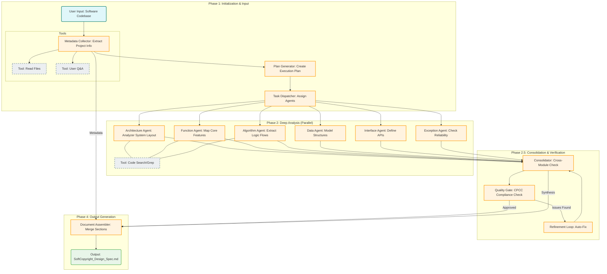

# Software Copyright Write Agent 

Version: V1.0

Introduction：TBD

## Workflow Design

```mermaid
graph TD
    subgraph Phase1 ["Phase 1: Initialization & Input"]
        A("User Input: Software Codebase") --> B["Metadata Collector: Extract Project Info"];
        B --> C["Plan Generator: Create Execution Plan"];
        
        subgraph Tools ["Tools"]
            B --> T1["Tool: Read Files"]
            B --> T2["Tool: User Q&A"]
        end
        
        C --> D["Task Dispatcher: Assign Agents"];
    end

    subgraph Phase2 ["Phase 2: Deep Analysis (Parallel)"]
        D --> E1["Architecture Agent: Analyzer System Layout"]
        D --> E2["Function Agent: Map Core Features"]
        D --> E3["Algorithm Agent: Extract Logic Flows"]
        D --> E4["Data Agent: Model Structures"]
        D --> E5["Interface Agent: Define APIs"]
        D --> E6["Exception Agent: Check Reliability"]
        
        %% Tools for Agents
        E1 --- T3["Tool: Code Search/Grep"]
        E2 --- T3
        E3 --- T3
    end

    subgraph Phase2_5 ["Phase 2.5: Consolidation & Verification"]
        E1 --> F["Consolidator: Cross-Module Check"];
        E2 --> F;
        E3 --> F;
        E4 --> F;
        E5 --> F;
        E6 --> F;
        
        F --> G["Quality Gate: CPCC Compliance Check"];
        G -- "Issues Found" --> H["Refinement Loop: Auto-Fix"];
        H --> F;
    end

    subgraph Phase4 ["Phase 4: Output Generation"]
        G -- "Approved" --> I["Document Assembler: Merge Sections"];
        I --> J("Output: SoftCopyright_Design_Spec.md");
        
        %% Internal Data Flow
        F -- "Synthesis" --> I
        B -- "Metadata" --> I
    end

    %% Styles
    classDef default fill:#f9f9f9,stroke:#333,stroke-width:2px;
    classDef input fill:#E0F7FA,stroke:#00796B;
    classDef process fill:#FFF3E0,stroke:#FF9800;
    classDef output fill:#E8F5E9,stroke:#4CAF50;
    classDef tool fill:#ECEFF1,stroke:#607D8B,stroke-dasharray: 5 5;

    class A input;
    class J output;
    class B,C,D,E1,E2,E3,E4,E5,E6,F,G,H,I process;
    class T1,T2,T3 tool;
```

